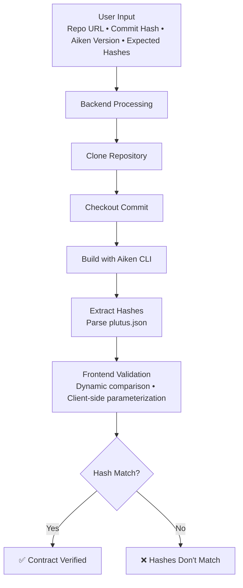
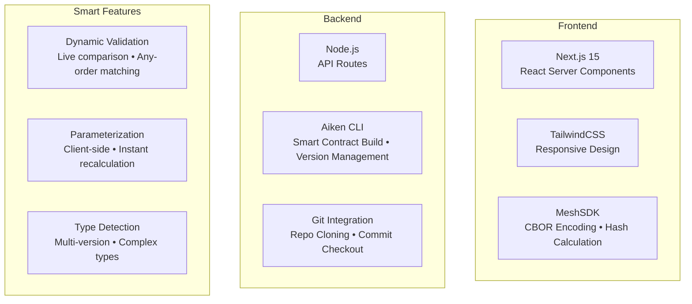

# UPLC Link Diagrams

This folder contains SVG diagrams for social media and documentation.

## Files

1. **flow-diagram.svg** - Shows how UPLC Link verification works
2. **tech-stack.svg** - Displays the technical architecture

## Usage for Twitter/X

Twitter/X works best with PNG images. To convert SVG to PNG:

### Option 1: Using a browser
1. Open the SVG file in Chrome/Firefox
2. Take a screenshot or use browser dev tools to export as PNG
3. Recommended size: 1200x630px for Twitter cards

### Option 2: Using CLI (if you have ImageMagick installed)
```bash
convert flow-diagram.svg -resize 1200x flow-diagram.png
convert tech-stack.svg -resize 1200x tech-stack.png
```

### Option 3: Online converter
- Visit https://cloudconvert.com/svg-to-png
- Upload SVG, download PNG

## Mermaid Source (Alternative)

You can also generate diagrams from this Mermaid code at https://mermaid.live:

### Flow Diagram


### Tech Stack


## License
Apache 2.0 - Same as the project
